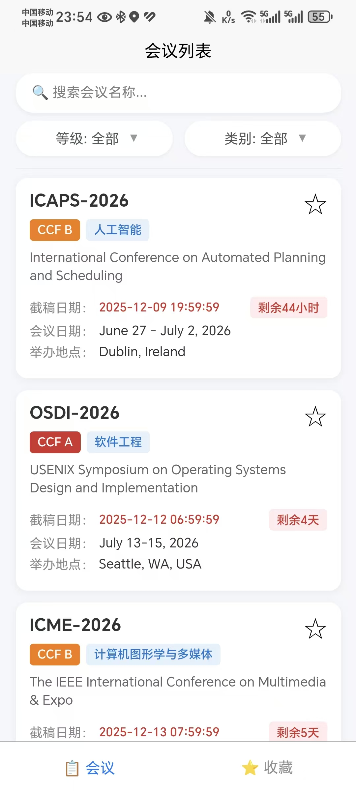
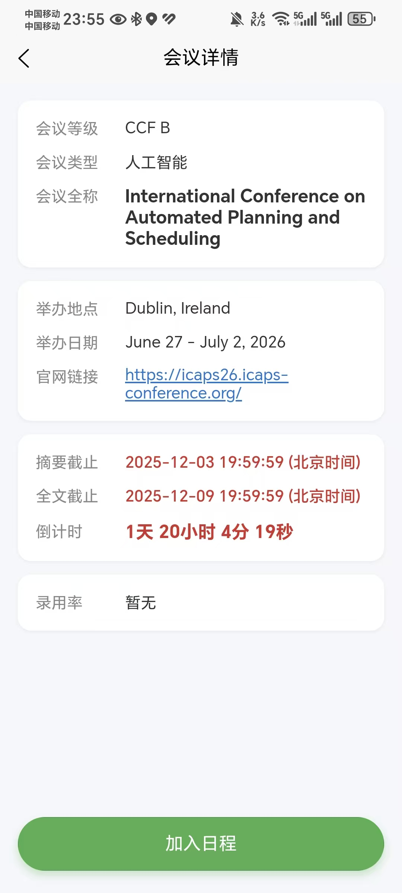
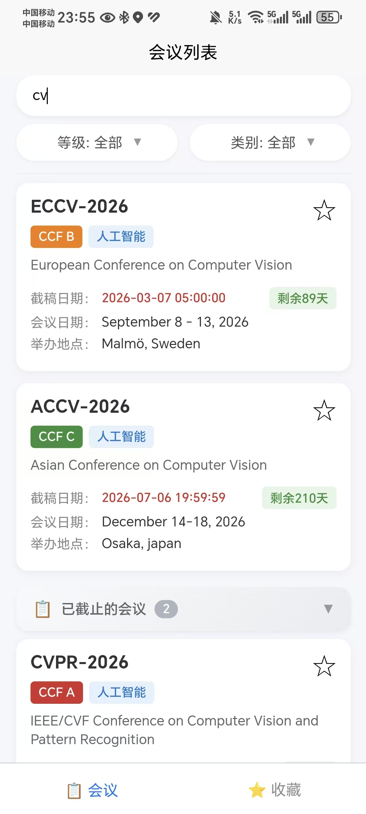
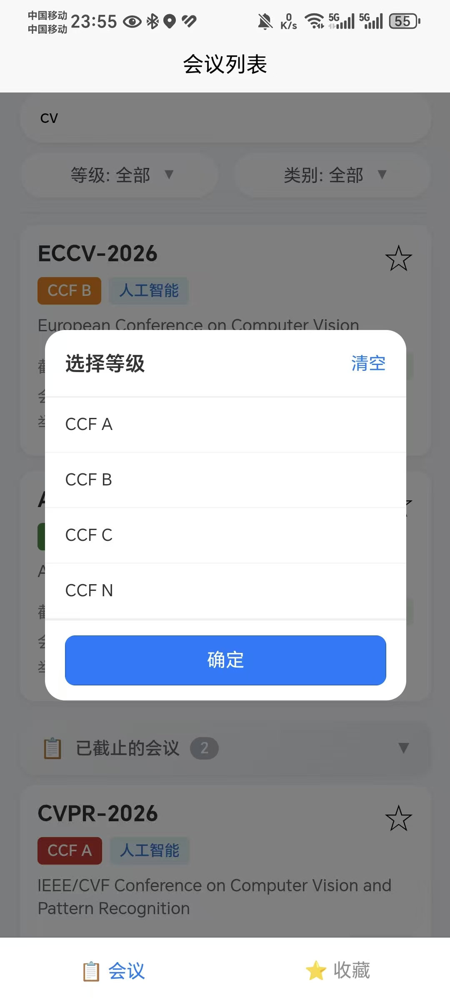
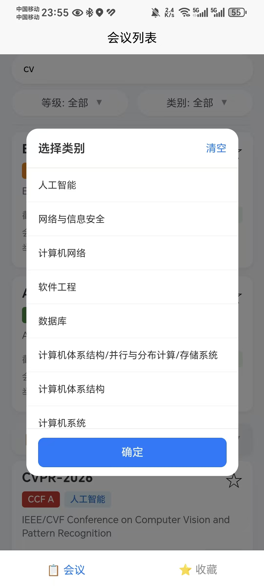
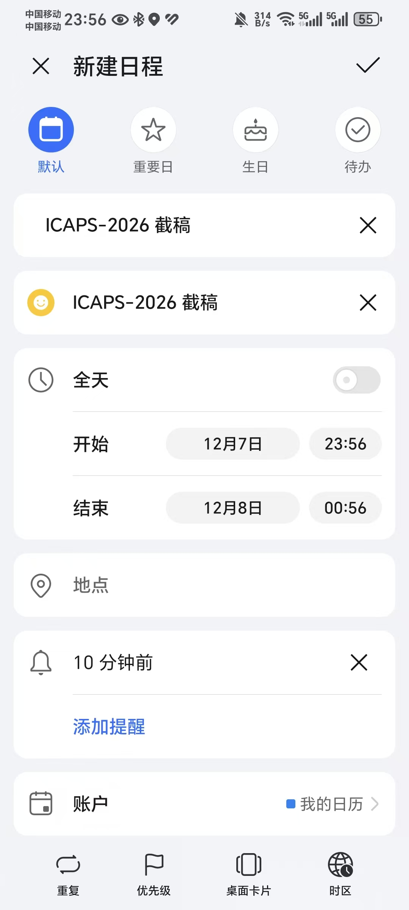
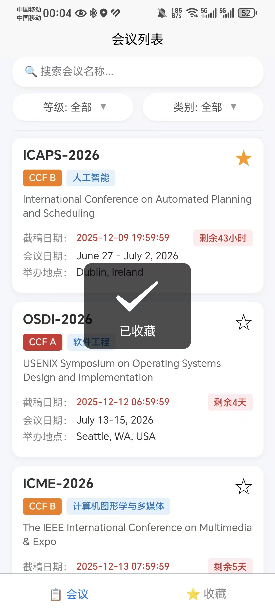
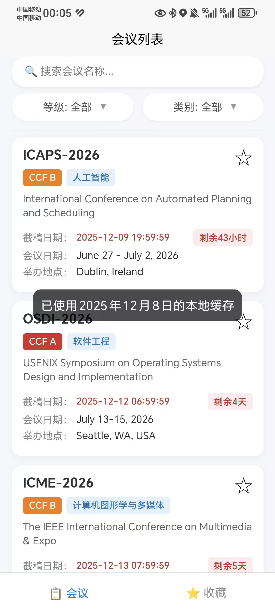

<!--
	README for CCF DDL
	- include project overview
	- installation & run steps
	- screenshot gallery
	- release & docs links
	- dev conventions / troubleshooting pointers
-->

# CCF DDL 

多端会议日程浏览器（基于 Vue 3 + uni-app + TypeScript + Pinia）
最新发布与 APK 见：release

---

## ✨ 项目简介

该仓库是一个轻量的会议日程浏览小程序/移动/网页应用示例：

- 支持 H5、APP（APP-PLUS）、小程序等多端运行
- 多维筛选会议（按日期、城市、类型、受邀情况等）
- 详情页支持导出/加入系统日历（.ics / 原生接口）
- 离线优先缓存策略、静态 acceptance-rate 索引作为后备

---

## 🎯 主要功能

- 浏览会议列表与详情
- 添加会议到系统日历（Android/iOS）
- 按筛选条件检索会议
- 离线缓存与数据健壮性（避免缓存被空数组覆盖）
- TypeScript 严格模式 + Pinia 状态管理
- 日志统一封装，构建时去除 console 输出

---

## 📸 截图示例

项目仓库包含一组屏幕截图（路径：`/screenshots`），示例：

<!-- 屏幕截图网格 -->
<div>
	
	
	
	
	
	
	
	
	
</div>

---

## 🛠 安装与本地运行

建议使用 Node v18+（或 22），npm 9+。

1. 安装依赖：

```powershell
npm install
```

2. 开发模式（H5 / App 模式由 uni-app 提供选项）：

```powershell
npm run dev
```

3. 构建生产包：

```powershell
npm run build
```

4. 代码风格 & 类型检查：

```powershell
npm run lint
npx tsc --noEmit
```

---

## 🧰 技术栈

- Vue 3（SFC）
- TypeScript
- Pinia（状态管理）
- uni-app（跨端框架）
- Vite（构建工具）
- ESLint + @typescript-eslint

---

## ✉️ 联系方式

如需更多信息，请通过电子邮件联系我们： [1847539781@qq.com](mailto:1847539781@qq.com)

# CCF DDL 
